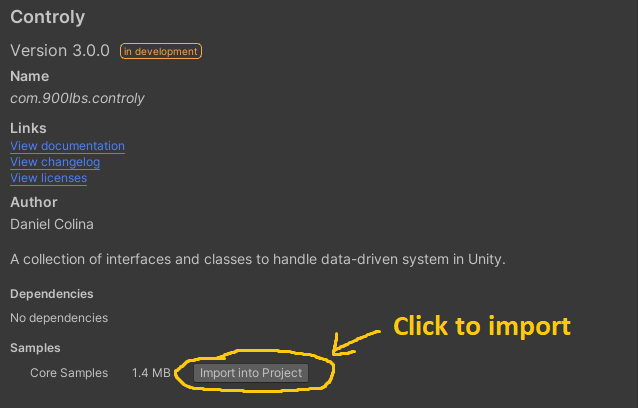

# Controly

A collection of interfaces and classes to handle data-driven systems in Unity.

## Installation

1. Make sure your Unity project has the [Unity UI](https://docs.unity3d.com/Packages/com.unity.ugui@1.0/manual/index.html) and [TextMesh Pro](https://docs.unity3d.com/Packages/com.unity.textmeshpro@2.0/manual/index.html) packages fully installed through the [Unity Package Manager](https://docs.unity3d.com/Manual/upm-ui.html).
1. Get the latest version of [DoozyUI](https://assetstore.unity.com/packages/tools/gui/doozyui-complete-ui-management-system-138361) and [install it into your Unity project](https://www.youtube.com/watch?v=4eFPI4tHE_w).
    * [Create an assembly definitions for DoozyUI](https://www.youtube.com/watch?v=asoFklJ8kfk) named `Doozy.Engine.asmdef` and `Doozy.Editor.asmdef`, respectively.
1. Get the latest version of [EnhancedScroller](https://assetstore.unity.com/packages/tools/gui/enhancedscroller-36378) and import it into your Unity project.
    * Create up an assembly definition for EnhancedScroller named `EnhancedScroller.asmdef` inside of `EnhancedScroller v2/Plugins`
1. Open the `manifest.json` file in the `Packages` folder of your project and add the following to the `"dependencies"` section:

    ```json
   "com.900lbs.controly": "https://github.com/dcolina900lbs/com.900lbs.controly.git#upm"
    ```

## Getting Started

1. Import the **Core Samples** through the Unity Package Manager. 

1. The **Core Samples** should import into your project's `Assets` directory similarly to the image below. 

1. Refresh the DoozyUI database to synchronize the custom theme in the **Core Examples**. 

1. Browse through the different scenes to see the framework in action!

1. If you want to dive deeper, [check out the wiki](https://github.com/dcolina900lbs/com.900lbs.controly/wiki) for breakdowns of the different interfaces and classes.
